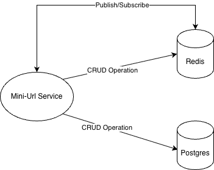

# Mini Url 🔗

A URL shortening service similar to TinyURL that allows users to create and manage shortened URLs with admin moderation capabilities.

## Features

### User Features

- **Create Short URLs**: Convert long URLs into short, manageable links
- **Delete Own URLs**: Remove your own shortened URLs
- **Secure Authentication**: JWT-based authentication system
- **Share Tiny Url**: User can share their tiny urls to the audience
- **URL Management Notifications**: Users receive real-time notifications when URLs are approved or rejected

### Admin Features

- **URL Moderation**: Approve or deny URL creation requests
- **Create Short URLs**: Convert long URLs into short, manageable links
- **User/Admin created Url Management**: Comprehensive admin controls
- **URL Creation Notifications**: Admin users receive real-time notifications when URLs are created

## Technology Stack

- **Backend**: ASP.NET Core
- **Database**: PostgreSQL
- **Cache**: Redis
- **Authentication**: JWT (JSON Web Tokens)

## Architecture



## URL Creation Process

When creating a new short URL, the system follows this 3-step process:

### Step 1: Get Thread-Safe Counter from Redis

- Retrieve an atomic counter value from Redis
- Ensures thread-safe operation across multiple requests
- Provides a unique, sequential number for each new URL

### Step 2: Encode to Base62 Format

- Convert the numeric counter to Base62 encoding
- Uses character set: `0-9, A-Z, a-z` (62 characters total)
- Creates short, URL-friendly codes (e.g., `1aB`, `2xY`, `3zQ`)

### Step 3: Save in Database

- Store the mapping in PostgreSQL database
- Record includes: short code, original URL, creator, and status
- New URLs start with "Pending" status awaiting admin approval

### Step 4: Notification

- Publish a url creation event to Redis

## Notification Flow

- When a short URL is created, approved, or rejected, the service publishes these events to designated Redis channels
- A background service monitors these Redis channels and forwards events to the appropriate WebSocket connections

_Note: Redis Pub/Sub enables horizontal scalability_

## Prerequisites

- .NET 8.0 or later
- PostgreSQL 12+
- Redis 6+

## Environment Variables

The following environment variables need to be configured for the application to run:

| Variable                        | Value                                         | Description                                              |
| ------------------------------- | --------------------------------------------- | -------------------------------------------------------- |
| `ASPNETCORE_ENVIRONMENT`        | `Development`                                 | Runtime environment setting                              |
| `DBConfig__Host`                | `localhost`                                   | PostgreSQL database host                                 |
| `DBConfig__Port`                | `5432`                                        | PostgreSQL database port                                 |
| `DBConfig__Database`            | `mini_url`                                    | Database name                                            |
| `DBConfig__Username`            | `postgres`                                    | Database username                                        |
| `DBConfig__Password`            | `admin`                                       | Database password                                        |
| `JWTConfig__Key`                | `7bF4$m@vJpZn8+eXy$R1*uKwG2cQhA^q5oL#T9iK6eB` | Secret key for JWT token generation                      |
| `JWTConfig__Issuer`             | `MiniUrl`                                     | JWT token issuer                                         |
| `JWTConfig__Audience`           | `MiniUrlApiUsers`                             | JWT token audience                                       |
| `JWTConfig__ExpiresInMinutes`   | `120`                                         | JWT token expiration time in minutes                     |
| `UrlConfig__BasePath`           | `http://localhost:8080`                       | **Base URL for shortened links (update for production)** |
| `UrlConfig__CacheExpiryMinutes` | `10`                                          | Redis cache expiration time for URLs                     |
| `RedisConfig__Hosts`            | `localhost:6379`                              | Redis server connection string                           |
| `RedisConfig__Username`         | `redis`                                       | Redis username                                           |
| `RedisConfig__Password`         | `redis`                                       | Redis password                                           |
| `RedisConfig__AbortConnect`     | `true`                                        | Whether to abort on connection failure                   |
| `RedisConfig__ConnectTimeout`   | `30`                                          | Connection timeout in seconds                            |
| `RedisConfig__Ssl`              | `false`                                       | Enable SSL connection to Redis                           |

## Important Notes:

- Update **UrlConfig\_\_BasePath** in production to match your domain, proxy, or load balancer URL
- Change all passwords and secret keys for production use
- Set **ASPNETCORE_ENVIRONMENT** to Production for production deployments

## Running the entire repo as containers

### 1. Clone the Repository

```bash
git clone <repository-url>
cd mini-url
```

### 2. Run Dependencies (Postgres and Redis)

```bash
cd LocalRun
docker-compose up -d
```

### 3. Set up admin account

Please refer to [this link](../LocalRun/README.md)

## Installation & Setup

### 1. Clone the Repository

```bash
git clone <repository-url>
cd mini-url
```

### 2. Run Dependencies (Postgres and Redis)

```bash
cd LocalDevelopment
docker-compose up -d
```

## Project Structure

| Directory                      | Description                                                                                                      |
| ------------------------------ | ---------------------------------------------------------------------------------------------------------------- |
| `MiniUrl/Commons/`             | Common constants and Utilities                                                                                   |
| `MiniUrl/Configs/`             | Configuration Models. Their attributes represent environment variable keys                                       |
| `MiniUrl/Controllers/`         | Controller Layers where API Urls are defined                                                                     |
| `MiniUrl/Data/Configurations/` | Database tables and column definitions from Database Entities                                                    |
| `MiniUrl/Data/AppDbContext.cs` | Entity Framework Database Context                                                                                |
| `MiniUrl/Documentations/`      | Documentations related data                                                                                      |
| `MiniUrl/Entities/`            | Database Entities                                                                                                |
| `MiniUrl/Exceptions/`          | Exceptions thrown by Service Layers and handled by Middleware to return specific http status codes and responses |
| `MiniUrl/Extensions/`          | Miscellaneous C# Extensions                                                                                      |
| `MiniUrl/Filters/`             | Filters                                                                                                          |
| `MiniUrl/Middlewares/`         | Exception Handler Middleware and WebSocket Middleware                                                            |
| `MiniUrl/Migrations/`          | Entity Framework Migrations                                                                                      |
| `MiniUrl/Models/`              | Models for API Requests, API Responses, Request Validators and Redis Pub/Sub                                     |
| `Miniurl/Services/*.cs`        | All Service Interfaces and their implementations                                                                 |
| `MiniUrl/Services/Background/` | Background Services for Redis Subscriber and Websocket Health Check                                              |
| `MiniUrl/WebSockets/`          | WebSocket Manager Interface, Implementation and internal WebSocket Model                                         |

_*For Interfaces and Implementations, you may refer to [this readme file](./Documentations/ServiceDetailsReadme.md).*_

_*For API Contract, you may refer to [this swagger json file](./Documentations/SwaggerAPI.json).*_
